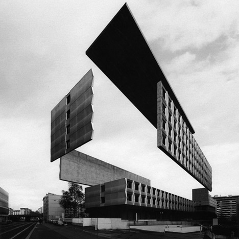

O processo de _Construção da cidade_, tem por objetivo criar uma versão onírica da cidade onde os jogadores moram com seus problemas ou acontecimentos recentes, e se dará em duas partes.

1. Construção das áreas da cidade
2. Criação dos pesadelos

    **Caso os jogadores morem em cidades diferentes** uma boa opção é criar uma mistura destas cidades, inspirando-se em locais de cada uma delas para a criação de áreas e pesadelos. Como alternativa, os jogadores (incluindo o MJ) podem optar por apenas uma dentre estas cidades ou mesmo qualquer outra cidade que conheçam.
    A única exigência é que sejam cidades que os jogadores conheçam e tenham meios de obter informações da mesma.

## Construção das áreas da cidade

Há esta altura (após a criação de personagens) cada jogador deverá ter uma carta do **Baralho de construção** sobrando em sua mão. O MJ, se ainda não o tiver feito, deve comprar agora uma carta do mesmo baralho.

Cada jogador, incluindo o MJ deve colocar na mesa a sua carta que sobrou do **Baralho de Construção** virada para cima, adjacente à outra carta já colocada na mesa (se houver). Então este jogador deverá descrever que área é aquela, notando o naipe da carta.

A intenção aqui é obter uma área conhecida de sua cidade (pode ser uma parque, um prédio, uma construção inacabada, uma rodovia, etc) e transformá-la numa área a ser explorada durante o jogo. Lembre sempre que se trata do _sonho da cidade_, então esta área não precisa ser idêntica a sua contraparte real. Pelo contrário, ela deve ser de alguma forma distorcida ou difusa.

Note que o naipe da carta é importante nesta definição, pois determina o ambiente ou natureza da área, mas você pode transformar sua área de inspiração para combinar com o naipe.

Decidido o local e as características dele, anote num pedaço de papel uma identificação para o mesmo e dobre-o de forma que fique de pé, para todos poderem ler. Faça qualquer anotação adicional numa cópia da planilha da cidade.

> **Ex.**
>
> Jéssica vai utilizar sua carta, um Rei de Paus (K♣), para criar uma área. Ela decide utilizar a escola em que estudou na sua infância como inspiração e questiona os outros jogadores sobre como poderia ser esta escola no _sonho da cidade_.
>
> Carlos, o MJ, atenta para o naipe, que indica uma área selvagem, e sugere que a escola pode estar abandonada há muitos anos e tomada pela mata próxima. Agora a própria escola parece crescer junto com a floresta e novos corredores e salas de aula surgem a cada ano, transformando o local num verdadeiro labirinto vivo.
>
> Jéssica gosta de ideia, então anota num papel "Escola abandonada", dobra e o deposita sobre a carta.
> <!-- mapa de cartas -->
> <table class="table-bordered citymap">
>     <tr>
>         <td>
>             

>                 
>                 Escola abandonada
>             

>         </td>
>     </tr>
> </table>

Lembre de pedir opinião dos outros jogadores. Esta fase de Construção da cidade deve ser coletiva, onde todos ajudam a construir as áreas.

## Criação dos pesadelos

Após definir a área, o jogador deverá criar um **Pesadelo** que o atormenta.

A intenção deste Pesadelo é que reflita algum problema ou acontecimento recente da cidade, de preferência, mas não obrigatoriamente, associado ao local original. Tente se lembrar de fatos marcantes das últimas semanas, ou meses, que poderiam ser usados. Se não conseguir pensar em nada, uma notícia de um jornal qualquer deve fornecer inspiração suficiente.

Novamente, transforme este problema ou acontecimento em algo que apareceria num sonho. Não use descrições explícitas, mas deixe espaço para a imaginação.

    **Aviso:**
    Usar fatos reais em jogos narrativos pode ser perigoso. Tenha certeza que seu grupo concorda com isso e que ninguém se sinta perturbado pelos acontecimentos ou notícias escolhidos. Como dica, evite problemas pessoais e prefira aqueles que influenciem um grande número de pessoas e distorça os mesmos o suficiente para apenas lembrar o fato original.
    Se ainda assim seu grupo não se adequar a este método, apenas invente um pesadelo.

Decidido o **Pesadelo** que atormenta esta área, note o valor da carta e, dependendo deste, compre de 1 (uma) à 3 (três) cartas do **Baralho de desafio** e, sem olhar, coloque-as de face para baixo sob a carta da área.

Este será o poder do Pesadelo presente naquele local.

* **J** Coloque 1 (uma) carta do **Baralho de desafio**, de face para baixo, sobre a carta da área
* **Q** Coloque 2 (duas) cartas do **Baralho de desafio**, de face para baixo, sobre a carta da área
* **K** Coloque 3 (três) cartas do **Baralho de desafio**, de face para baixo, sobre a carta da área

> **Ex.**
>
> Jéssica lembra de surto de uma doença que houve numa escola perto de sua casa e questiona os demais como poderiam usar isto para construir um Pesadelo.
>
> Após alguma discussão o grupo decide que alguma coisa está transformando tudo na escola em plantas, inclusive as crianças que estudavam lá. Qualquer um que permaneça muito tempo na escola começa a sentir uma sonolência, e mais tarde enrigecimento dos membros. Se não sair em breve acaba por não poder se mover mais.
>
> Como sua carta era um Rei (K), Jéssica compra três cartas do Baralho de desafio e, sem olhar, coloca todas com a face virada para baixo sob o Rei que agora representa a "Escola abandonada".

Note que a notícia usada apenas falava sobre uma doença, mas não qual o que ela causa. A dica aqui é que as notícias devem ser usadas apenas como inspiração, mesmo indiretamente, e o Pesadelo deve ser apenas um problema vago, sem indicar como este deve ser resolvido.

No decorrer da aventura o grupo pode ser levado a buscar uma cura para a doença, ou a enfrentar o xamã maléfico que lançou uma madição sobre a escola, mas por hora não sabemos.

<small>_créditos da imagem: [Variations On a Dark City, by Espen Dietrichson](http://www.dezeen.com/2012/09/22/variations-on-a-dark-city-by-espen-dietrichson/)_</small>
