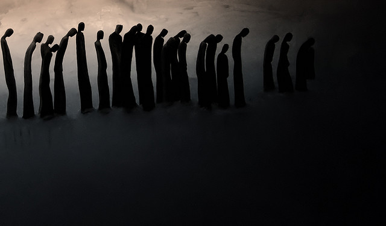

# Criação de personagens

Apesar deste capítulo se chamar de criação de personagens, você não estará propriamente criando um personagem nesta etapa, mas sim escolhendo um estereótipo pré-definido de acordo com a lista abaixo. Isto porque o único personagem que realmente fará parte da história é a Cidade, os PJs são apenas manifetações dos sonhos da Cidade.

Claro, se nenhum dos estereótipos da lista a seguir lhe parecer atraente, você pode criar seu próprio, mas tenha em mente o impacto (da função/profissão) que ele causará nos NPCs (do inglês, _non player characters_, ou personagens não jogadores), pois isso será relevante no jogo.

## Estereótipos de personagens

<!--
|   | J                        | Q                    | K                 |
| - | ------------------------ | -------------------- | ----------------- |
| ♠ | Soldado ou Policial raso | Juíz/oficial militar | Prefeito          |
| ♦ | Mercador                 |                      | Ricasso da cidade |
| ♣ | Camponês                 | Druída               | Líder espiritual  |
| ♥ | Marinheiro               |                      | Capitão           |
-->

<table class="table table-bordered">
    <thead>
        <tr>
            <th></th>
            <th>J</th>
            <th>Q</th>
            <th>K</th>
        </tr>
    </thead>
    <tbody>
        <tr>
            <td>♠</td>
            <td>Soldado ou Policial raso</td>
            <td>Juíz/oficial militar</td>
            <td>Prefeito</td>
        </tr>
        <tr>
            <td>♦</td>
            <td>Mercador</td>
            <td></td>
            <td>Ricasso da cidade</td>
        </tr>
        <tr>
            <td>♣</td>
            <td>Camponês</td>
            <td>Druída</td>
            <td>Líder espiritual</td>
        </tr>
        <tr>
            <td>♥</td>
            <td>Marinheiro</td>
            <td></td>
            <td>Capitão</td>
        </tr>
    </tbody>
</table>

No começo do jogo, cada jogador (menos o mestre) deve pegar duas cartas da pilha de figuras e escolher dentre elas a que preferir para o seu estereótipo de personagem, conforme a tabela acima.

Por exemplo, um Valete (J) de Espadas (♠) representa um _soldado ou policial sem muita importância_, enquanto um Rei (K) de Ouros (♦) representa o _Ricasso da cidade_.

Escolhida a carta, dê um nome ao seu personagem (ou escolha uma alcunha, se preferir, o que importa é como chamá-lo), descreva sua aparência para os demais, e pronto.

# As cartas restantes

Como cada jogador obteve duas cartas, sobrará uma em sua mão.

Estas cartas serão usadas para a criação da cidade onírica em que se passará a história, conforme veremos no próximo capítulo.

<small>_créditos da imagem: [Light and Darkness](http://nancysblog-seeker.blogspot.co.uk/2011/03/light-and-darkness.html)_</small>
