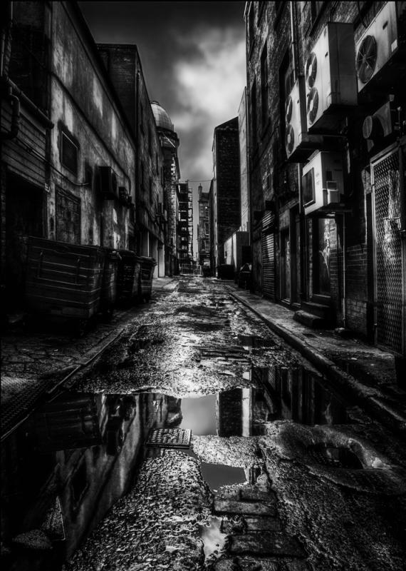

Sua cidade está morrendo...

Um mal se espalha por seu corpo -- uma doença -- entupindo suas veias, corroendo seus órgãos e mitigando a vida de cada organismo que nela habita. A cidade sofre e os homens não percebem isso ou, se percebem, nada fazem, como se ignorassem que são apenas hospedeiros dela, apenas vermes e bactérias que vivem em simbiose com a mesma.

Em seu mundo desperto, as consequências são palpáveis -- Problemas de trânsito, assaltos, assassinatos, fome, desemprego, abandono -- mas são nos sonhos que tais consequências são mais devastadoras...

## **...Sonhos que se tornaram pesadelos**

A cidade sonha, como qualquer ser vivo -- e sim, a cidade está viva.

Há cidades que sonham com mais frequência e há aquelas que o fazem apenas raramente, mas todas sonham, e nesses sonhos elas se modificam. Suas maiores construções se tornam palácios, reinos ou até mundos inteiros. Suas estátuas e imagens são deuses e seus bosques são infestados de elfos e fadas.

Pelo menos, assim eram as coisas antes da doença...

Agora animais selvagens se tornam monstros horrendos, deuses caídos comandam legiões de seguidores em guerras sangrentas, e a própria doença se manifesta na forma de demônios, devorando os vivos e corroendo cada estrutura que toca. O sonho da cidade se tornou um grande pesadelo sombrio, com perigos mortais espreitando em cada canto.

<small>_créditos da imagem: [Dark City Streets, by Paul Cook Photography](http://www.whatdigitalcamera.com/gallery/showimage.php?i=1432&c=38)_</small>