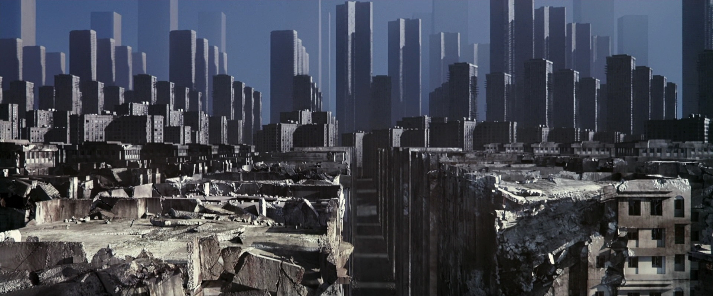

Até agora o conjunto de regras de Criação de personagens e Construção da cidade visavam jogos mais curtos, mais precisamente de uma única sessão. Isso porque _Nos sonhos da cidade_ não possui coisas como fichas de personagens e sistema de evolução. Mas então, para histórias mais longas ou até campanhas, como fica?

Basicamente, a Cidade continua sonhando, e assim evolui. Novas áreas são adicionadas, novos Pesadelos aparecem, etc. Enquanto que os PJs são trocados a cada nova sessão.

A seguir vou mostrar um conjunto simplificado das regras citadas visando jogos mais longos. Estas regras são para o início de novas sessões de histórias em andamento.

## Criação de novos personagens

O processo de criação é exatamente o mesmo...

Cada jogador compra duas cartas do **Baralho de construção** e escolhe a que preferir delas de acordo com a tabela de estereótipos de personagens, guardando a carta que sobrar para a próxima fase. 

Essa troca de personagens tem por objetivo dar ênfase na cidade, e não nos PJs.

Claro, seu antigo personagem não precisa desaparecer, ele ainda pode influenciar na história, afinal há ações que ele realizou que refletiram em mudanças no sonho. Ou ainda, seu novo personagem pode ser uma nova face -- ou um novo ponto de vista -- do personagem anterior, porém com nova aparência e habilidades.

Em resumo, seu novo personagem pode apenas parecer diferente, ou pode ser uma pessoa completamente diferente. É você quem decide isso.

### Onde estão minhas Relíquias

Se você não utilizou todas Relíquias que dispunha até o final da última sessão, o normal é que elas desapareçam ou que o PJ precise obtê-las novamente.

O ideal em _Nos sonhos da cidade_ é terminar cada "capítulo" da história no final de uma sessão, este não é um jogo que se beneficie muito de _cliffhangers_, mas claro, sempre há exceções.

Caso faça sentido que uma Relíquia não usada persista de uma sessão para a outra, considere que seu novo personagem a obteve do antigo -- ou simplesmente se materializou no sonho com ela, isso não importa tanto, -- contudo, o jogador deve comprar uma nova carta do **Baralho de desafio** para representar o poder da Relíquia. Ou seja, você mantém sua Relíquia, mas a carta dela deve ser uma nova.

## (Re)Construção da cidade

A cidade permanece intacta, exatamente como estava na última sessão.

Se você preencheu corretamente a _Planilha da cidade_, então poderá reproduzir o Mapa facilmente. Apenas separe as cartas relevantes do **Baralho de construção** e coloque-as novamente na mesa seguindo as informações da planilha.

1. Separe as cartas usadas na cidade até o momento
2. Seguindo as informações _A direita de_ e _Abaixo de_ da Planilha da cidade, reconstrua o _Mapa da cidade_
3. Sob cada carta do Mapa da cidade, coloque a quantidade de cartas do **Baralho de desafio** que correspondem ao poder do Pesadelo.

Pronto, você reconstruiu a cidade. Agora vamos adicionar algumas coisas a mais.

Cada jogador ainda terá em sua mão uma carta do **Baralho de construção** que sobrou após a criação de personagens. Com esta carta ele pode escolher uma das opções a seguir. O MJ também deve comprar uma única carta do **Baralho de construção** para tomar uma das ações a seguir.

* **Criar uma nova área**

    Exatamente como na construção da cidade, o jogador cria uma nova área baseando-se numa área real, conhecida, de sua cidade.

    A diferença aqui é que não será criado um Pesadelo para esta área. Uma área sem pesadelo pode ser uma fonte de Relíquias durante o progresso da história.

* **Adicionar um Pesadelo** a uma área livre

    O jogador utiliza sua carta para adicionar um Pesadelo a qualquer área que já não tenha algum, utilizando as mesmas regras de Pesadelos da Construção da cidade. Esta área pode ser uma que foi salva/curada pelos PJs numa sessão anterior, ou uma nova área criada por outro jogador.

    O poder e a natureza deste Pesadelo dependem da nova carta. O naipe desta carta pode até mesmo mudar o ambiente da área, se o jogador assim desejar.

* **Aumentar o poder de um Pesadelo**

    A carta pode ser usada para aumentar o poder de um Pesadelo existente, se for de valor maior que a carta original do Pesadelo. Não é possível reduzir o poder de um Pesadelo desta forma.

* **Descartar a carta**

    A carta não é utilizada e não altera a cidade.

    Como dica, evite simplesmentes descartar cartas, visto que esta é uma oportunidade para aumentar a cidade e com isso as opções de exploração na história ou até criar novos desafios.

# Acabaram minhas cartas, e agora?

Com apenas 12 cartas no **Baralho de Construção**, após uma segunda sessão é possível que estas acabem, dependendo do número de jogadores.

A intenção de usar apenas um baralho é para equilibrar os estereótipos dos PJs e as áreas/pesadelos das cidades, contudo, no caso das cartas estarem acabando, a solução óbvia é adicionar um novo baralho, então simplesmente faça isso. 24 cartas deve ser suficiente para muitas sessões de jogo.

O **Baralho de desafio**, por outro lado, dificilmente ficará limitado, embora seu uso contínuo pode fazer as cartas acabarem durante as sessões. Neste caso, apenas pegue novamente as cartas da pilha de descarte (as já usadas) e embaralhe-as novamente.

<small>_créditos da imagem: Cena do filme [Inception](http://www.imdb.com/title/tt1375666/)_</small>
