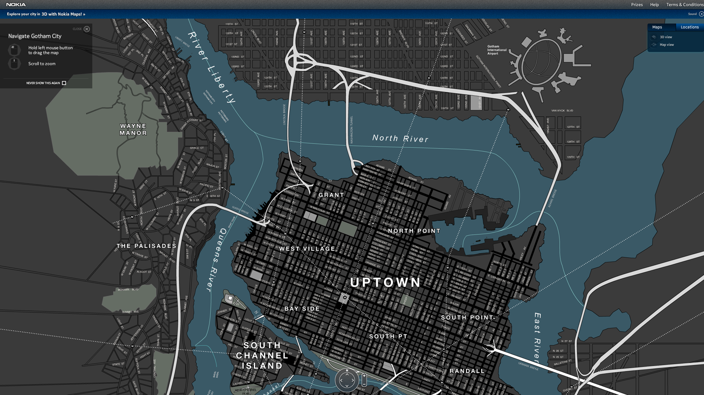
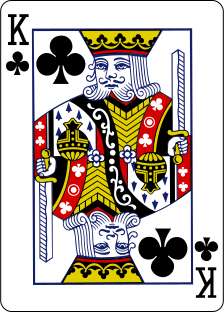
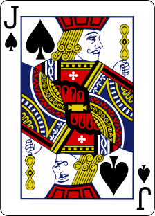
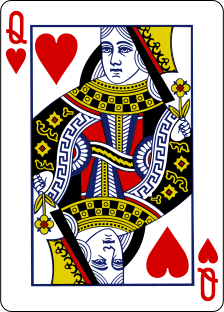

Você como jogador, estará interpretando uma parte do sonho da cidade. Uma parte bem consciente, sim, capaz de raciocinar, ter ideias, realizar façanhas e, principalmente, perceber que alguma coisa está errada, perceber que a cidade está doente.

Contudo, este personagem, esta parte do sonho que é o PJ, não é importante para a história...

O único personagem que importa, é a própria _Cidade_. O único que precisa ser salvo e o único que tem poder para isso.

## A planilha (ficha) da cidade

Como todo bom personagem, a cidade possui uma planilha, uma ficha que a descreve, incluindo suas qualidade e defeitos, seus poderes, etc.

O modelo desta planilha está a seguir. Ela deve ser prenchida ainda na preparação do jogo, durante a _Criação da cidade_, sendo que a parte **_Áreas conhecidas_** é repetida para cada área que foi criada para a cidade.

<table class="table table-bordered">
    <thead>
        <tr>
            <th class="text-right">_Nome da cidade:_</th>
            <td width="50%"></td>
            <td class="text-right">01</td>
            <th class="text-left">dias sonhando</th>
        </tr>
        <tr>
            <th colspan="4">Áreas conhecidas</th>
        </tr>
    </thead>
    <tbody>
        <tr>
            <td colspan="4">
                <table class="table table-bordered">
                    <tr>
                        <th class="text-right">Nome da área:</th>
                        <td width="30%"></td>
                        <th class="text-right">Carta:</th>
                        <td width="30%"></td>
                    </tr>
                    <tr>
                        <th class="text-right">À direita de:</th>
                        <td width="30%"></td>
                        <th class="text-right">Abaixo de:</th>
                        <td width="30%"></td>
                    </tr>
                    <tr>
                        <th colspan="2">Características:</th>
                        <th colspan="2">Pesadelo:</th>
                    </tr>
                    <tr>
                        <td colspan="2" height="160"></td>
                        <td colspan="2" height="160"></td>
                    </tr>
                </table>
            </td>
        </tr>
        <tr>
            <th colspan="4">Escreva o sonho ao acordar...</th>
        </tr>
        <tr>
            <td colspan="4" height="160"></td>
        </tr>
    </tbody>
</table>

Vamos explicar melhor cada item da planilha:

* **Nome da cidade**

    Óbvio, né? O nome da cidade onde se passa a história. Pode ser o nome da cidade em que a história se baseia ou uma referência à ele. O importante é não esquecer que cidade é.

* **_dias sonhando_**

    A quandidade de dias que a cidade sonha. Geralmente será o número de sessões de jogo, para jogos mais longos.

* **Áreas conhecidas**

    As áreas da cidade que foram criadas pelo MJ e jogadores durante a _Construção da cidade_. Vamos aos detalhes delas a seguir.

    * **Nome da área**

        O nome pelo qual a área é conhecida no jogo. Uma identificação simples, de uma ou duas palavras, que possa ser anotada num pedaço de papel e colocado sobre a carta da área.

    * **Carta**

        A carta que foi usada para criar a área e determinar o _Poder_ do pesadelo. Útil especialmente para manter jogos mais longos, quando você reconstruir o _Mapa da cidade_.

    * **À direita de**

        Nome da área que fica à esquerda desta, se alguma. Também útil para reconstruir o mapa da cidade.

    * **Abaixo de**

        Nome da área que fica acima desta, se alguma. Também útil para reconstruir o mapa da cidade.

    * **Características**

        Características desta área. Estes são os detalhes que foram definidos para diferenciar o sonho da realidade, baseando-se no tipo de ambiente (o naipe) da área.

    * **Pesadelo**

        O Pesadelo que atormenta esta área atualmente, se houver algum, com suas características e qualquer descrição que seja necessária.

* **Escreva o sonho ao acordar**

    Espaço destinado (você também pode usar um caderno) a um resumo dos acontecimentos da última sessão, afinal, sonhos são fáceis de esquecer após algum tempo.

## Mapa da cidade

O mapa da cidade é uma grade de cartas do **Baralho de construção** que é montado durante a **Construção da cidade**.

Nele, as áreas ficam dispostas umas adjacecentes às outras, podendo fazer vizinhança com uma ou mais áreas.

Veja os exemplos à seguir, comparando com o preenchimendo das áreas na  _Planilha da cidade_.

<!-- primeira carta: K♣ -->
<table class="table table-bordered">
    <tr>
        <th class="text-right">Nome da área:</th>
        <td width="30%">**Escola abandonada**</td>
        <th class="text-right">Carta:</th>
        <td width="30%">K♣</td>
    </tr>
    <tr>
        <th class="text-right">À direita de:</th>
        <td width="30%">--</td>
        <th class="text-right">Abaixo de:</th>
        <td width="30%">--</td>
    </tr>
</table>
<!-- segunda carta: J♠ -->
<table class="table table-bordered">
    <tr>
        <th class="text-right">Nome da área:</th>
        <td width="30%">**Hospital macabro**</td>
        <th class="text-right">Carta:</th>
        <td width="30%">J♠</td>
    </tr>
    <tr>
        <th class="text-right">À direita de:</th>
        <td width="30%">Escola abandonada</td>
        <th class="text-right">Abaixo de:</th>
        <td width="30%">--</td>
    </tr>
</table>
<!-- terceira carta: Q♥ -->
<table class="table table-bordered">
    <tr>
        <th class="text-right">Nome da área:</th>
        <td width="30%">**Há peixes no estacionamento!**</td>
        <th class="text-right">Carta:</th>
        <td width="30%">Q♥</td>
    </tr>
    <tr>
        <th class="text-right">À direita de:</th>
        <td width="30%">--</td>
        <th class="text-right">Abaixo de:</th>
        <td width="30%">Hospital macabro</td>
    </tr>
</table>

<!-- mapa de cartas -->
<table class="table-bordered citymap">
    <tr>
        <td>
            

                
                Escola abandonada
            

        </td>
        <td>
            

                
                Hospital macabro
            

        </td>
    </tr>
    <tr>
        <td></td>
        <td>
            

                
                Há peixes no estacionamento!
            

        </td>
    </tr>
</table>

Em histórias mais longas, como Campanhas, o Mapa da cidade deve crescer bastante a medida que novas áreas são adicionadas.

## Caminhando pela cidade

Embora o mapa da cidade indique a localização de uma área em realação as outras, não é obrigatório considerar este posicionamento durante a narrativa.

No nosso exemplo, para que os PJs fosse da _Escola abandonada_ até a área identificada como _Há peixes no estacionamento!_ deveriam passar primeiro pelo _Hospital macabro_...

Num caso como este, minha dica é: Considere as áreas que devem ser passadas, **apenas se forem relevantes para a história**. Se uma área que esteja no caminho de seu destino puder fornecer algo interessante para a história, então narre a passagem dos PJs também por esta área, mas se esta passagem for demorada e frustrante, apenas deixe para lá e chegue logo no destino.

Note que o Mapa da cidade não fornece também nenhuma informação acerca de tamanho das áreas e distâncias. Isto é intencional... Se o tamanho de uma área é importante, delalhe isto nas características da área. Quando às distâncias, considere distâncias relativas, como perto, longe ou muito longe, afinal, tudo não passa de um sonho.

<small>_créditos da imagem: Nokia Maps, [Gizmodo](http://www.gizmodo.in/software/All-of-Gotham-City-in-3D-Or-Traditional-Online-Map-Form/articleshow/19170060.cms)_</small>
