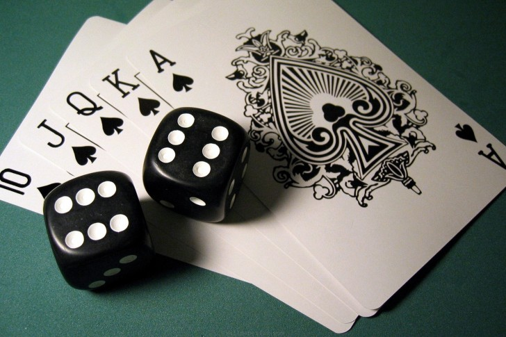

Testes e conflitos, em _Nos sonhos da cidade_, tem por objetivo determinar o rumo da história e não, necessariamente, sucesso ou fracasso contra uma oposição. Em outras palavras, o resultado de um teste deve ter significado na história e decidir o que acontecerá à seguir.

Deixe o teste definir o rumo da história.

Agumas dicas para o MJ:

* Tenha claramente em mente o que ocorrerá após cada resultado, antes de pedir o teste.
* Pense no futuro, o resultado não precisa ser imediato. Pelo contrário, ele funciona melhor se as consequências persistirem por dias, ou até durante toda a história.
* Evite que os jogadores possam insistir repetidamente num teste. Deixe claro que os resultados não podem ser revertidos.
* Considere sucessos parciais ao invés de falhas para alguns testes, isso pode permitir à historia progredir dando espaço para novos desafios depois.

Todos os testes em _Nos sonhos da cidade_ são realizados com a rolagem 1 a 3 de dados comuns de 6 faces (_d6_) --  vamos chamá-los aqui apenas de _dados_, visto que são o único tipo utilizado.

    **Regra opcional:** Como dados de 6 faces (valores de 1 a 6) podem ter dificuldade para superar cartas do **Baralho de desafio** (valores de 1 a 10) você pode decidir usar dados de 10 faces (_d10_) para testes e conflitos. 
    Contudo, note que isto reduzirá em muito a dificuldade dos testes do jogo e quase inibirá a necessidade de **Relíquias** (veja a seguir) que são, na minha opinião, um elemento importante de narrativa e recompensas.

Basicamente três tipos de testes serão feitos durante o jogo, testes para _superar desafios_, _tomar decisões_ e _conflitos contra pesadelos_.

### Preciso mesmo fazer um teste?

Dado que cada pesonagem possui qualificação em determinada área, muitas vezes um teste pode ser evitado, e o MJ apenas indica que o PJ obteve sucesso ao tentar superar um desafio.

Considere os seguintes casos para garantir um sucesso automático para superar um desafio.

1. **Estereótipo do personagem** implica que ele tem possui conhecimento ou experiência suficiente para obter sucesso.

    Se, por exemplo, o _Druida_ do grupo tenta obter o rastro de um inimigo na floresta, ele não precisa obrigatoriamente fazer um teste, pois seu _Estereótipo_ implica que o PJ saiba como rastrear em terreno selvagem. Dessa forma o MJ pode, simplesmente, dizer que o PJ obteve sucesso em sua demanda.

2. **Não há rumo diferenciado** da história para o caso de uma falha.
    
    Simples, se o MJ (e nenhum jogador) não prevê o que pode acontecer no caso de uma falha, deixa para lá e apenas considere um sucesso.

## Superando desafios

Estes serão os testes mais comuns e frequentes duranta as histórias. O MJ deve pedir um teste para superar um desafio quando:

1. Existe uma oposição frente ao objetivo dos PJs?
2. Nenhum PJ é qualificado para superar o desafio automaticamente?
3. Uma falha no teste implica num rumo diferente para a história?

Quando **todas as questões** forem verdadeiras, então o MJ deve determinar a dificuldade do desafio e comprar uma quantidade de cartas do **Baralho de desafio** de acordo com a mesma:

* **Desafio fácil à médio:** 1 (uma) carta
* **Desafio difícil:** 2 (duas) cartas
* **Desafio muito difícil:** 3 (três) cartas
* **Desafio excepcional à impossível:** 4 (quatro) ou mais cartas

A maioria dos desafios não deve exigir a compra de mais do que uma carta. 4 (quatro) ou mais cartas devem ser reservados apenas para casos muito específicos, que exijam o uso de **Relíquias** (veja adiante) para obter sucesso, provavelmente envolvendo ps PJs numa busca adicional antes de poderem superar o desafio.

Decidida a dificuldade do desafio, o MJ compra a quantidade aplicável de cartas e às revela ao PJ que tentará superá-lo. O PJ então, deve rolar seus dados e obter um resultado igual ou maior a soma do valor das cartas (o naipe não é relevante aqui), a quantidade de dados rolados depende do valor da carta do PJ.

* **J** recebe **1 (um) dado** para superar um desafio que esteja de acordo com seu estereótipo.
* **Q** recebe **2 (dois) dados** para superar um desafio que esteja de acordo com seu estereótipo.
* **K** recebe **3 (dois) dados** para superar um desafio que esteja de acordo com seu estereótipo.

Se o personagem que estiver tentando superar o desafio não tiver qualificações contra o mesmo (Ex.: um camponês tentando convencer um militar) ele não recebe nenhum dado. A única forma de superar um desafio desta forma é com o uso de **Relíquias** (veja adiante).

## Tomando decisões

Testes para tomadas de decisões devem ser pedidos sempre que o grupo chega a um impasse frente a uma abordagem e a escolha do rumo de ações irá influenciar explicitamente na história. 

Eles são realizados da mesma forma que os testes para _Superar desafios_, com o MJ comprando uma ou mais cartas para definir o valor a ser superado.

O resultado de um teste de _Tomada de decisão_ pode até mesmo adicionar fatos ao passado do PJ ou do grupo como um todo, indicando que o(s) PJ(s) tenham um favor a cobrar ou conhecimento prévio de uma área, por exemplo.

Tenha em mente uma das perguntas a seguir:

* Existem duas ou mais formas de resolver um problema?

    ou ainda...

* Existem dois ou mais caminhos para o destino adiante?

Se a resposta for _Sim_, pondere rapidamente sobre as alternativas e peça o teste para definir qual delas é válida.

> **Ex.**
>
> Ao atravessar uma floresta, o personagem de Antonio, um Elfo da floresta, avista movimento mais à frente e o grupo questiona entre si se poderiam ser amigos ou inimigos.
>
> Neste momento o MJ pede à Antonio que role um teste contra uma dificuldade média (uma carta) e compra um 9♠ (Nove de espadas).
>
> Antonio rola seus três dados e obtém: 4, 1, 1, somando um total de 6, o que não é suficiente.
>
> O MJ, devido ao resultado, narra que o movimento eram um grupo de homens-sapo que embosca os PJs e acabam por levá-los, presos por mãos e pés, para sua aldeia. Um sucesso no teste, por outro lado, decidiria que eram Elfos patrulhando a floresta e que poderiam ajudar os PJs a atravessá-la em segurança.

## Enfrentando pesadelos

Enfrentar um pesadelo é o que existe de mais próximo de um combate em _Nos sonhos da cidade_, porém este _combate_ não representa, necessariamente, um embate físico, sendo mais provavelmente uma série de desafios a serem superados, dependendo da natureza do pesadelo.

Quando o grupo de PJs finalmente puder enfrentar um pesadelo, note o _Poder do pesadelo_, representado pela quantidade de cartas sob a _carta da área_ onde este se encontra -- estas serão as cartas que impõem a dificuldade do desafio.

Revele as cartas de poder do pesadelo e some seus valores, então permita ao PJ que estiver enfrentando o pesadelo rolar seus dados, exatamente como faria para superar um desafio.

Note os possíveis resultados à seguir:

* **Sucesso (valor igual ou superior)** O PJ supera um desafio imposto para derrotar o Pesadelo, o Pesadelo, então perde uma carta de poder (sempre a mais de baixo). 

    * Se esta for a única carta de poder que tiver atualmente, o Pesadelo é derrotado. A área que estava em seu domínio é então _curada_ ou _salva_ pelos PJs.
    * Se ouverem ainda outras cartas, novos testes devem ser feitos, até derrotar o Pesadelo (até que a última carta seja removida). -- Garanta que os próximos testes signifiquem algo na história, como mudanças no Pesadelo que impôem novos desafios.

* **Falha (valor menor)** No caso de uma falha no teste, uma de duas coisas podem acontecer. Em ambos os casos, um novo teste pode ser feito para tentar novamente vencer o Pesadelo.

    * **O pesadelo fica mais forte:** O MJ compra mais um carta do **Baralho de desafio** e coloca sob a carta da área. Se nova tentativa de vencer o Pesadelo for realizada ela é revelada de imediato e já soma no total a ser superado pelos testes.
    * **O PJ é devorado** O PJ que enfrentou o Pesadelo é devorado pelo mesmo e deixa de existir. -- Recomendo deixar esta opção para final de sessões, onde a perda do PJ não deixará o jogador "fora da história" por muito tempo.

# Relíquias

**Relíquias** são armas, equipamentos, itens mágicos, habilidades... Enfim, qualquer coisa que possa ajudar os PJs a vencer desafios.

Elas devem ser obitas em buscas adicionais durante a história, como prêmio por ajudar NPCs, dedicação em aprender algo novo, ou simplesmente visitar certo lugar. Generalizando, sempre que algum objetivo principal (vencer um Pesadelo, especialmente) for impossível para as habilidades atuais dos personagens, a solução é procurar uma relíquia que possa ajudar na tarefa.

Sempre que um PJ obtiver uma **Relíquia**, este deve comprar uma carta do **Baralho de desafio** e guardá-la em sua mão. Em qualquer teste ou conflito em que este PJ se envolver posteriormente, ele pode usar a Relíquia para adicionar seu valor ao teste -- o uso da relíquia pode ser declarado após a rolagem dos dados -- após o qual a Relíquia é descartada.

Em vias de regra, as Relíquias são a compensação da dificuldade de superar os valores de poder (das cartas) com apenas as habilidades (os dados) dos PJs. Contudo, deve-se ter alguns cuidados ao incluir Relíquias na história.

> Ex.
>
> O PJ de Jéssica esta enfrentando o Pesadelo que transformava as crianças em plantas na Escola abandonada, uma máquina demoníaca que espalha um névoa na escola que, ao tocar as pessoas, as transforma lentamente em plantas.
>
> As três _Cartas de poder_ do Pesadelo são 7♠ 2♠ 4♥, dando um total de 13. Jéssica rola 6 + 2 + 1, o que não é suficiente. Porém, numa busca anterior, seu PJ adquiriu a Relíquia _Mascara hospitalar_ ao ajudar uma enfermeira. A máscara previne os danos da névoa quando usada, o dá à PJ de Jéssica mais tempo para sabotar a máquina.
>
> Jéssica diz que vai usar sua Relíquia, colocando a máscara enquanto desconecta os cabos da máquina. A carta da Relíquia é um 5♣, que soma aos dados e garante um total de 14, agora suficiente para vencer o Conflito.

## Regras e dicas sobre Relíquias

* **Relíquias fazem parte da história**

    Evite colocar Relíquias em jogo apenas mecanicamente, elas não são simples itens ou armas mágicas que podem ser compradas numa loja qualquer.

    Para obter uma Relíquia os PJs devem se aventurar numa nova busca -- de preferência pequena, que não dure muito mais do que 15 ou 20 minutos, mas ainda assim é uma busca. -- É responsabilidade do MJ deixar claro que busca é esta, ou pelo menos dar algumas dicas.

    Uma boa opção para receber relíquias é favores devidos aos PJs por NPCs após, por exemplo, livrar uma área de seu Pesadelo. Outra boa opção é forçar os PJs a se moverem para outra área com um tipo de ambiente diferente, como buscar ferramentas numa cidade grande (♠) para escavar uma antiga mina (♦).

    O importante é dar significado para as Relíquias, tornando-as algo relevante para a história e que sejam divertidas de obter.

* **Relíquias só podem ser usadas uma única vez**

    Assim que um PJ usar uma relíquia que possua, ela está fora do jogo.

    A menos que a perda da Relíquia, de algum modo não faça sentido, esta regra deve ser seguida. Por isso é importante evitar criar Relíquias indestrutíveis.

    Em casos muito especiais, como uma Relíquia que pudesse ser usada várias vezes (um arco e suas flechas por exemplo), simplesmente dê ao jogador uma quantidade maior de cartas, mas tenha em mente que isso pode desequilibrar o desafio do jogo.

* **Crie Relíquias em grupo**

    Embora seja tentador -- ou até tradicional -- que o MJ crie Relíquias e imponha as condições para sua aquisição, pode ser muito mais divertido fazer isso em grupo.

    Dado que o poder básico de uma Relíquia é pré-definido (uma carta do **Baralho de desafio**) mas seu valor é aleatório, sempre que o grupo de PJs ficar _encalhado_ em algum lugar, sem ter recursos de como avançar, proponha uma pausa -- ou mesmo uma discussão _in game_ -- para decidir que tipo de relíquia ajudaria o grupo e onde ela poderia ser obtida.

    Depois de algum tempo, os jogadores irão naturalmente propor a criação de relíquias, simplesmente dizendo algo como _"Aquele mestre ancião do templo talvez possa nos ajudar, ele tinha poções para quase tudo"_.

### Poder das relíquias

Por padrão, o poder de uma Relíquia é sempre 1, ou seja, uma carta do **Baralho de desafio**. Porém nada impede que existam Relíquias mais poderosas em jogo. Apenas tenha em mente que Relíquias muito poderosas podem desequilibrar o jogo.

Eu, particularmente, prefiro dar a opção dos PJs obterem várias Relíquias, envolvendo inclusive buscas diferentes para elas. Afinal, nada impede que o PJ utilize mais de uma ao mesmo tempo, se as tiver disponíveis.

# Sobre cartas de dados

Como ja dito, _Nos sonhos da cidade_ utiliza tanto cartas de baralho como dados para gerar entropia. Basicamente, as cartas são a mecânica usada pelo MJ enquanto os dados são usados pelo PJs -- as Relíquias são uma exceção à isto.

Isto pode gerar um temor de que as dificuldades (geradas pelas cartas) serão estatisticamente maiores do que as habilidades dos PJs (gerados pelos dados), inclusive o sistema deixa como opção o uso de dados de 10 lados (_d10_) para eliminar esta diferença. Mas a verdade é que existe um motivo das cartas serem usadas pelo MJ, Pesadelos e Relíquias...

Ao contrário de dados, Cartas de baralho são previsíveis.

Após o primeiro conflito com um Pesadelo, mesmo que o PJs não o vençam, saberão o valor exato de seu poder (com uma variação de 1 a 10 para cima, se ele tiver aumentado o poder pela vitória), da mesma forma, o valor exato de uma Relíquia é conhecido assim que esta é obtida por um PJ e mesmo o consumo das cartas durante o jogo (as compras e descartes) permitem uma previsão do que virá a seguir para olhos mais atentos.

Essa previsibilidade permite um pouco de estratégia por parte dos jogadores. Estratégia esta que não necessariamente os ajudará a _ganhar o jogo_, mas irá guiá-los por caminhos específicos durante o jogo, enquanto eles decidem a melhor forma de combater os Pesadelos ainda existentes.

<small>_créditos da imagem: [cards, dice wallpaper](http://wallpapersus.com/cards-dice/)_</small>
